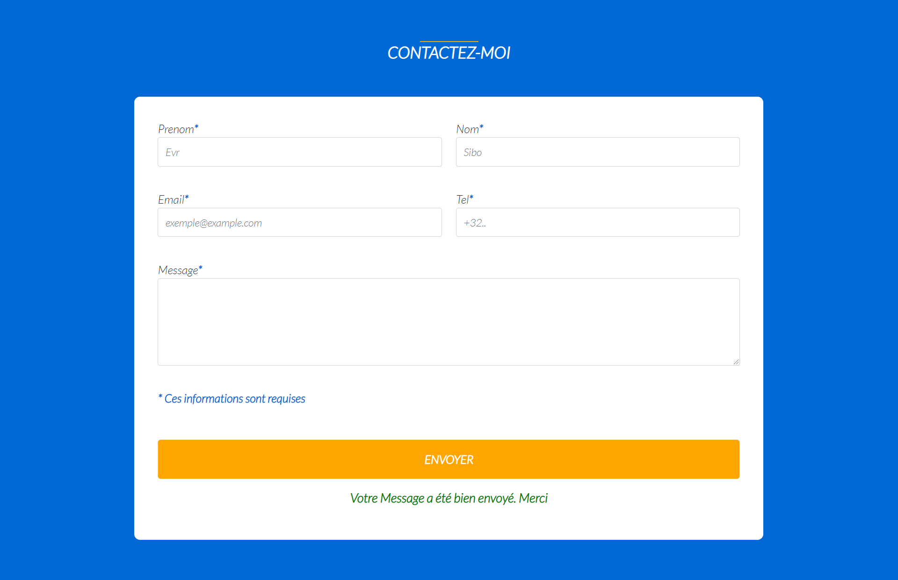

# Form-PHP
 

Realization of a solo project 

## See the project

You can view the web page via this url [Form_php](https://hackepoulette.herokuapp.com/)

## Library / Toolkit
* Html
* Css
* Php
* Jquery
* Bootstrap

## Author

* **evrardsibo** _alias_ [@evrardsibo](https://github.com/evrardsibo)

